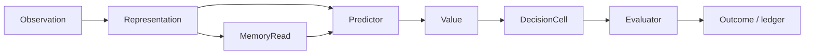

# Cell role contracts and staged implementation

**Status:** design and source-qualification boundary  
**Scope:** `neuron.runtime`, `memory.retrieval`, `learning.operator`,
`utility.ndu`, `intuition.policy`, `automation.taskflow`,
`learning.artifacts`, `learning.eval`, `learning.plasticity`, CNS and
learning-ledger owners  
**Production claim:** none. This document defines the contracts and gates that
must exist before a role can be called a production cell type.

This document extends the existing DecisionCell contract. It does not claim
that the repository already contains ten independent cell runtimes. The shared
`NeuronRuntime` remains the execution substrate. A role becomes an independent
cell type only after it has a typed input/output contract, state schema,
parameter/update cadence, owner, split transform, recovery path, resource
budget and role-specific long-horizon evaluation.

## 1. Architectural decision

The first useful general-agent loop is:

```text
Representation -> MemoryRead -> Predictor -> Value -> Decision -> Evaluator
```

The loop is assembled as a Neural Circuit. `DecisionCell` remains the common
trainable policy unit. `Planner`, `Router`, `ActionProposal` and `Plasticity`
are initially circuit roles or owner adapters; they do not automatically become
new runtime classes.

A role is a semantic responsibility, not an expert count. Multiple instances
of one role may be sparse experts, and a router may select them, but MOE
routing does not grant a role authority to write memory, commit an effect,
change a route generation or promote its own artifact.

The following boundaries remain deterministic:

- schema and digest validation;
- candidate completeness and legal-set filtering;
- safety veto and abstention admission;
- signature, transaction and deletion checks;
- TaskFlow/CNS lifecycle and route fencing;
- artifact/CAS/registry publication;
- learning-ledger and independent evaluator writes.

A cell can propose, score or abstain. It cannot become the authority owner by
returning a high score.

## 2. P0: role contract, without ten runtimes

P0 defines the versioned role boundary while reusing `NeuronRuntime` for
execution. The types below are required design surfaces; the exact Rust names
are reserved for the versioned implementation and must not be retrofitted into
`CellSplitV1` in place.

| Contract | Required fields | Initial owner or source boundary |
| --- | --- | --- |
| `CellRoleV1` | `Representation`, `MemoryRead`, `Predictor`, `Value`, `Decision`, `Evaluator`, `Planner`, `Router`, `ActionProposal`, `Plasticity`, `Communication` | `codex-rs/hepta-types` or the role-contract crate; no authority |
| `CellCapabilityProfileV1` | observation/output/state schema digests, ports, owner module, persistence class, update mode, fallback role, objective, resource and evaluation profiles | role adapter; checked before circuit admission |
| `CellDefinitionV2` | identity, generation, scope digest, lineage digest, role, capability profile, parameter bundle, state schema, port ABI, owner, objective, fallback, evidence owner | registry-facing definition; `learning.artifacts` owns publication |
| `CellStepReceiptV1` | cell identity/generation, input frontier, predecessor/successor state, output digest, uncertainty/OOD, abstain/slow-path, resource and evidence receipts | shared step adapter; no effect authority |
| typed role payloads | `RepresentationResultV1`, `RecallPacketV1`, `PredictionResultV1`, `ValueEstimateV1`, `DecisionPolicyV1`, `EvaluationResultV1`, `PlanCandidateV1`, `RouteDecisionV1`, `ActionProposalV1`, `UpdateProposalV1` | role-specific adapter and evaluator |
| `CellPersistenceClassV1` | `Ephemeral`, `Checkpointed`, `Durable`, `LedgerBacked` | existing owner; never implicit global state |
| `CellUpdateModeV1` | `InferenceOnly`, `OutcomeProposal`, `OnlineConstrained`, `BatchCandidate` | `learning.plasticity`/`learning.artifacts` admission |
| role transition | parent role, child role, compatibility, state transform, port transition and evaluation digests | `CellDefinitionV2`; explicit cross-role transition only |

Every payload binds identity, generation, scope, bundle, input frontier,
state predecessor/successor, output, uncertainty, resource evidence and
provenance. A digest without the corresponding owner receipt is not an
activation proof.

### P0 owner mapping

The initial mapping reuses existing owners rather than creating parallel
stores:

| Role | Source-qualified primitive | Required adapter boundary |
| --- | --- | --- |
| Representation | `codex-rs/hepta-neuron::NeuronModelPort`, `NeuronRuntime`, `LocalModelRuntimeReceiptV1`; sensor/operator core contracts in `codex-rs/hepta-bellman-operator` | Bind encoder/normalizer/model generation, missingness, OOD and resource receipt to `RepresentationResultV1` |
| MemoryRead | `codex-rs/hepta-memory-retrieval` (`generator`, `engram`, `decision`); HNMF and cognitive-store contracts in `docs/hnmf` and `docs/modules/memory.retrieval` | Read only approved, scoped evidence; return provenance, freshness, contradiction and abstention |
| Predictor | `codex-rs/hepta-bellman-operator::world_model` (`TabularWorldModelV1`, `WorldModelPredictionV1`) | Bind state/action/world revision, horizon, uncertainty and synthetic-prediction marker |
| Value | `codex-rs/hepta-ndu` evaluator/scoring and `codex-rs/hepta-bellman-operator` | Keep value, risk, cost and advantage advisory; independent outcome remains authoritative |
| Decision | `codex-rs/hepta-neuron` plus `codex-rs/hepta-intuition` calibrated decision | Require complete legal candidates, hard veto, exact propensity, abstain and slow path |
| Evaluator | `codex-rs/hepta-intuition` calibration/OOD and `codex-rs/hepta-intelligence-eval` independent/future-window evaluation | Produce disposition; cannot select, promote or write its own result |
| Planner/Router | `codex-rs/hepta-automation` TaskFlow/Circuit; CNS contract in `docs/cns` and route-fence owners | Bounded frontier and route generation; no direct effect or global store |
| ActionProposal | typed proposal at the circuit boundary; effect owner in `docs/modules/kernel.operations` | Validate preconditions, expiry, effect class and propensity; downstream owner executes |
| Plasticity | `codex-rs/hepta-neuron` eligibility/modulator primitives and `codex-rs/hepta-plasticity` | Emit next-snapshot `UpdateProposal`; never mutate selected inference state |

The owner mapping is a source location and composition plan. It is not proof
that the adapters are activated on a target host.

## 3. P1: five-core adapters and the closed loop

P1 implements the first five role adapters around the current substrate:

1. **Representation** receives approved observations and emits a typed
   representation with encoder/normalizer generation, source scope,
   missingness, OOD, confidence and resource evidence.
2. **MemoryRead** receives a bounded query and returns approved evidence,
   provenance, freshness, contradiction support and an explicit abstention
   when the source is unavailable or out of scope.
3. **Predictor** consumes representation, memory and a legal action/state
   context. It returns a bounded transition or outcome distribution tied to a
   world-model revision. A prediction is synthetic and never becomes a fact.
4. **Value** scores the complete candidate set with utility, risk, cost,
   advantage and uncertainty. It cannot change the objective or select itself.
5. **Evaluator** checks calibration, OOD, coverage, negative transfer, cost
   and retention. It returns `Accept`, `Abstain`, `SlowPath`, `Quarantine` or
   `Rollback` for a governed owner to apply.

`DecisionCell` consumes these outputs, applies legal-candidate and safety
admission, emits policy/propensity and may abstain. A typical circuit is:



The evaluator and ledger are outside the cell's authority. The cell may consume
their next approved snapshot, but it may not rewrite a historical decision or
turn a forecast into a durable fact.

### P1 source-qualification gates

Each adapter must pass the following repository gates before target-host work:

- canonical round-trip and unknown-critical-field rejection;
- maximum input, output, state and candidate bounds;
- generation, scope, owner and port-ABI mismatch rejection;
- deterministic golden vectors and tie ordering;
- no-change and ablation vectors;
- state predecessor/successor replay;
- role-specific negative paths (OOD, missing source, contradiction,
  insufficient evidence, stale world revision, invalid candidate set);
- no authority escalation, no effect execution and no self-promotion;
- resource receipt shape and origin validation;
- independent evaluator/proposer identity separation.

A source-qualified adapter is still not a production cell. Activation requires
an external target-host receipt with host and observer signatures, real artifact
and registry commits, live route dispatch, restart/power-loss/rollback/tombstone
witnesses, hardware counters and an independent future-window evaluation.

## 4. P2: Planner and Router as Neural Circuit roles

The first Planner and Router implementation belongs in Neural Circuit and
TaskFlow, not in a new scheduler or executor.

### Planner profile

A planner owns a bounded search frontier, partial plan, preconditions,
fallback, rollback path, horizon and cost budget. It emits `PlanCandidateV1`.
It does not execute the plan. TaskFlow/CNS owns activation, joins, waits,
recovery and lifecycle.

Planner source gates:

- frontier and plan size limits;
- deterministic expansion and tie ordering;
- precondition/effect compatibility;
- explicit fallback and rollback path;
- deadline and resource budget enforcement;
- restart replay without reviving an expired frontier.

### Router profile

A router chooses among a complete set of already admitted routes or experts.
It binds route generation, child scope, route ABI, fallback and propensity. CNS
or the route owner fences the old generation and performs activation order.

Router source gates:

- complete/legal candidate set;
- generation and ABI match;
- old-route rejection after cutover;
- fallback and slow-path behavior;
- load/resource/latency budget;
- no route creation or authority mutation by the scoring policy.

The MOE relationship is therefore explicit: a Router profile can sparsely
activate multiple experts of one or more roles. `CellRole` describes semantic
responsibility; an MOE expert describes a parameter/runtime instance. They are
orthogonal.

## 5. P3: typed ActionProposal

`ActionProposalV1` is a proposal only:

```text
action_id
arguments_digest
precondition_digest
effect_class
deadline
expiry
propensity
evidence_digest
```

The downstream effect owner validates credentials, authority, preconditions,
expiry, idempotency and final payload. The proposal cell cannot call a tool,
send a message, mutate a provider, hold credentials or self-confirm success.
Production activation requires a retained dispatch receipt and an independently
observed effect outcome.

## 6. P4: Plasticity as an outcome-driven producer

Plasticity consumes prediction error, utility residual and independent
resource/safety signals. Existing eligibility traces, modulators, parameter
group maps, trust regions and sufficient statistics in
`codex-rs/hepta-neuron` and `codex-rs/hepta-plasticity` should be wrapped as an
`UpdateProposalV1`.

The proposal targets the next immutable parameter/artifact snapshot. It must
not mutate selected weights, promote itself, change topology or bypass
`learning.artifacts`, `learning.eval` or the learning-ledger owner. A no-update
result is a valid terminal outcome when an independent evaluator attests it.

## 7. P5: role-specific split and production activation

Do not extend `codex-rs/hepta-types::CellSplitV1` in place with a role field.
That contract is the existing DecisionCell split semantics and its content
digest/replay behavior is already qualified. Use `CellDefinitionV2` and bind
its digest from a versioned split or transition contract. A cross-role split
must name the parent and child roles, compatibility contract, state transform,
port transition, objective and evaluation policy.

Each role requires an independent split profile:

- parameter inheritance or reinitialization;
- recurrent, eligibility, optimizer and cache migration;
- data/task partition and route predicate;
- role-specific resource budget;
- rollback, retire, quarantine and tombstone;
- target-host evidence and clean-room replay;
- independent future-window retention and negative-transfer evaluation.

Until these external receipts exist, the role is a `CellRoleProfile` or source
adapter, not a production independent cell type.

## 8. Per-role evaluation metrics and acceptance gates

Decision accuracy is not a universal cell metric. The metric owner must freeze
the baseline, observation window, holdout and evaluator identity before a role
can be compared.

| Role | Core metrics | Required failure/acceptance evidence |
| --- | --- | --- |
| Representation | OOD, calibration, missingness, representation drift, latency, memory | encoder/normalizer generation replay; source-scope rejection; target-host latency/memory receipt |
| MemoryRead | recall coverage, contradiction detection, freshness, abstention, provenance | source and scope replay; stale/tombstone rejection; independent evidence coverage |
| Predictor | NLL, Brier, multi-step error, calibration, OOD, world-revision compatibility | frozen-world baseline; synthetic marker; unsupported state/action rejection; future-window error |
| Value | Bellman residual, value bias, risk calibration, cost prediction, negative transfer | independent outcome join; objective immutability; no self-selection; cost/resource witness |
| Decision | regret, propensity, coverage, abstain rate, task success | complete legal set; hard-veto and slow-path vectors; observed outcome and retention |
| Evaluator | false accept, false reject, OOD detection, retention/rollback precision | evaluator/proposer separation; quarantine/rollback replay; independent holdout |
| Planner | plan validity, constraint violation, cost, horizon, recovery rate | bounded frontier; precondition/fallback/rollback proof; restart replay |
| Router | route coverage, load balance, latency, resource cost, fallback rate | live dispatch receipt; route ABI/generation; old-route fence and no-resurrection |
| ActionProposal | schema validity, precondition validity, effect classification, expiry handling | downstream owner receipt; denied authority and expired proposal tests |
| Plasticity | update usefulness, retention, forgetting, rollback rate, resource cost | next-snapshot artifact; independent evaluator; rollback and future-window witness |

Every metric set must include a **no-change baseline**. A split or role update is
retained only when the declared utility/coverage gain survives the future window
without exceeding latency, memory, communication, training, migration, failure
or rollback budgets.

## 9. Source qualification versus production activation

These are separate states:

| State | What it proves | What it does not prove |
| --- | --- | --- |
| Source qualification | contracts, validators, golden vectors, deterministic replay and negative paths exist in the repository | a target device loaded the artifact, switched routes or improved long term |
| Host qualification | a named target host produced signed artifact, route, restart, power-loss, rollback, tombstone and hardware receipts | independent future-window retention or fleet-wide generality |
| Production activation | host and observer evidence, registry/CAS/route replay, learning-ledger witness and future-window evaluator all pass clean-room replay | biological equivalence or unrestricted general intelligence |

The production gate is fail-closed. No local simulation, planner digest, unit
test, static source search or synthetic CPU/GPU/NPU sample can mint production
activation. The target-host protocol and current strict matrix are documented in
[`CELL_SPLIT_ACCEPTANCE.md`](../CELL_SPLIT_ACCEPTANCE.md) and
[`CELL_SPLIT_FUTURE_WINDOW_RUNBOOK.md`](../CELL_SPLIT_FUTURE_WINDOW_RUNBOOK.md).

The intended lifecycle remains:

```text
role observation
  -> typed signal
  -> governed plan
  -> evaluate
  -> canary
  -> route activation
  -> outcome ledger
  -> future-window evaluation
  -> retain / quarantine / retire / rollback
```

Until the lifecycle is externally observed and replayed, the repository may
claim a source-qualified role contract but must keep the production result at
`0/8` under the strict acceptance rule.
