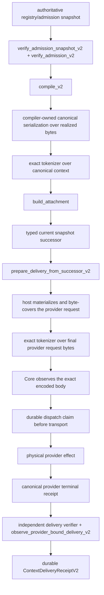

<!-- GENERATED FILE: edit MODULE_MANIFEST.json and run scripts/generate_context_compiler_module_docs.py --write. -->
# `context.compiler` current product path

## Current status

| Dimension | State | Evidence-based interpretation |
|---|---|---|
| Core implementation | **complete** | V2 compilation, verified admission, canonical byte coverage, typed snapshot successor, attachment, delivery preparation and provider evidence observation are implemented. |
| Product composition | **partial** | The named registry/intelligence/Agentd path, durable stage owner and Core exact-encoded-body observer are composed in source. Strict preparation and V2 terminal accounting are not yet the sole default serving path. |
| V2 provider closure | **incomplete** | Core can now fail closed on the exact encoded request body, while the strict compiler owns canonical serialization and exact-tokenizer attestations. A qualified concrete tokenizer, authoritative admission owner and sole-path preparation/terminal composition remain open. |
| Current-head qualification | **absent** | No immutable qualification receipt for the exact branch head may be claimed before the qualification workflow completes. |

- Manifest SHA-256: `b7cf4f925ed5f11df464e0aa1014ba76249d001412c264a63c5c0ecff13069c0`
- Source fingerprint SHA-256: `51f436b386117226d4fe87f6b91b78ff821ac0d6f0d6b93190ba3b9ff7663896`
- Source objects in fingerprint: `38`
- Work package: `CTX-1-CONTEXT-COMPILER` / `integration_in_progress`

## Actual product callers

| Phase | Source | Symbol | Current state |
|---|---|---|---|
| registry compile | `codex-rs/hepta-intelligence/src/prompt_delivery.rs` | `compile_prompt_registry_v2` | legacy-compatible source composed |
| strict canonical compile | `codex-rs/hepta-intelligence/src/provider_bound_prompt.rs` | `prepare_provider_bound_prompt_v2` | source composed; not yet the default ingress |
| named product owner | `codex-rs/hepta-agentd/src/prompt_runtime.rs` | `AgentdPromptPipelineOwner` | legacy compile/stage owner active |
| strict durable stage | `codex-rs/hepta-agentd/src/provider_bound_prompt_runtime.rs` | `AgentdProviderBoundPromptRuntimeV2` | durable source composed; not sole serving owner |
| exact encoded body | `codex-rs/core/src/model_provider_policy/attempt_owner.rs` | `LeaseFinalRequestObserver` | physical pre-transport gate composed |
| provider lease ABI | `codex-rs/ext/extension-api/src/contributors/model_provider_policy.rs` | `observe_final_request` | exact-body callback composed |
| V2 terminal observation | `codex-rs/hepta-context-compiler/src/provider_delivery.rs` | `observe_provider_bound_delivery_v2` | source composed; terminal product adapter remains partial |

## Actual call graph

The physical exact-body observer is now present. The remaining architectural distinction is that
strict compilation/staging is not yet the default sole path and the current admission snapshot plus
V2 terminal receipt are not yet both resolved inside the same provider-attempt lifecycle.

## Concrete adapter truth

- **admissionVerifier:** Strict APIs require a verifier identity, but the current named product path still constructs provisional registry-bound admissions inside the same trust domain.
- **tokenizer:** Strict APIs tokenize actual canonical/final bytes and bind provider/model/binary/version/vocabulary/normalization identities; a concrete independently qualified production executable is not yet selected.
- **serializer:** CanonicalContextSerializerV2 is compiler-owned and does not accept caller-supplied final payload bytes.
- **providerRequest:** Core observes the exact encoded body immediately before transport and fails closed when a required observer is absent.
- **deliveryEvidence:** Canonical provider receipt validation exists; Agentd has not yet made the V2 receipt the sole durable terminal record.

## Supported roles

| Registry role | Product state |
|---|---|
| `DeveloperInstruction` | supported by the current runtime projection |
| `SystemInstruction` | fail closed: no exact typed provider slot |
| `UserTemplate` | fail closed: no exact typed provider slot |
| `ToolSchemaFragment` | fail closed: no exact typed provider slot |

Unsupported roles remain fail closed. They must not be silently projected into the developer slot.

## Legacy path

- Current state: compatibility path still compiled and currently active
- Cutover condition: Enable the strict path by default only after authoritative admission, exact-body pre-dispatch preparation and V2 terminal persistence are composed and qualified.

Legacy V1 receipts are compatibility evidence only and are never promoted into the V2 proof chain.

## Proof steps not yet closed

1. Move admission issuance and current revocation snapshots to a construction-closed registry authority owner.
2. Select and independently qualify the concrete provider/model tokenizer executable and artifacts.
3. Run prepare_delivery_from_successor_v2 from the exact-body pre-transport callback, not only before staging.
4. Make ContextDeliveryReceiptV2 the sole durable terminal accounting path and reconcile Indeterminate attempts.
5. Feature-gate the V1 runtime path after strict-path product qualification.
6. Produce exact-head, synthetic-merge, target-host benchmark and independent security-review evidence.

This document records source composition only. It grants no independent acceptance, activation,
promotion or release authority.
