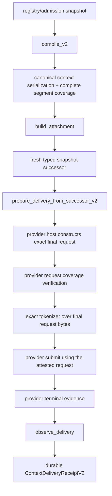

<!-- GENERATED FILE: edit MODULE_MANIFEST.json and run scripts/generate_context_compiler_module_docs.py --write. -->
# `context.compiler` technical development guide

## 1. Provenance and implementation state

- Module: `context.compiler`
- Reviewed base SHA: `a126987b84737dbc2ee2592442a314117bddb4a2`
- Working branch: `codex/context-compiler-v2-provider-closure-20260927`
- Source manifest: `docs/modules/context.compiler/MODULE_MANIFEST.json`
- Canonical manifest SHA-256: `e17a47bffce932b36eac91d7d1a5a1160a6ffe83d8f5809c8e9bd5809a48f930`
- Generator: `scripts/generate_context_compiler_module_docs.py`

| Dimension | State | Evidence-based interpretation |
|---|---|---|
| Core implementation | **complete** | V2 compilation, verified admission, canonical byte coverage, typed snapshot successor, attachment, delivery preparation and provider evidence observation are implemented. |
| Product composition | **partial** | Prompt registry, hepta-intelligence, Agentd and the provider-policy extension consume context compiler outputs, but the strict provider-bound V2 preparation is not yet the only serving path. |
| V2 provider closure | **incomplete** | The provider host ABI exposes request digests but no qualified exact tokenizer over the final provider request bytes; strict attestation therefore fails closed until the host capability is supplied. |
| Current-head qualification | **absent** | No immutable qualification receipt for the exact branch head may be claimed before the qualification workflow completes. |

The state words above are deliberately independent. A complete core library does not imply that
the product host has supplied exact final-request bytes, a qualified tokenizer, durable terminal
composition, or a successful receipt for the current Git SHA.

## 2. Scope and trust boundary

`context.compiler` selects admitted context under a deterministic budget, verifies the realized
selected bytes, emits a canonical context payload, rechecks a monotonic admission snapshot
immediately before dispatch, and authenticates provider terminal evidence. It does not own network
I/O, provider credentials, model execution, or the provider-specific request encoder.

The strict V2 boundary treats admission verifiers, provider framing policies, exact tokenizers and
provider evidence verifiers as qualified host capabilities. Missing capabilities and identity
mismatches fail closed. Candidate-level registered token costs may guide preselection, but they are
not accepted as proof of the final provider request token count.

## 3. Authoritative source locations

- `codex-rs/hepta-context-compiler`
- `codex-rs/hepta-intelligence/src/prompt_pipeline.rs`
- `codex-rs/hepta-intelligence/src/prompt_delivery.rs`
- `codex-rs/hepta-agentd/src/prompt_runtime.rs`
- `codex-rs/ext/hepta-prompt/src/lib.rs`
- `codex-rs/core/src/model_provider_policy`

Public strict-path surface:

- `compile_v2`
- `record_canonical_serialization_v2`
- `build_attachment`
- `verify_typed_admission_snapshot_successor_v2`
- `prepare_delivery_from_successor_v2`
- `verify_provider_request_coverage_v2`
- `tokenize_verified_provider_request_v2`
- `observe_delivery`

## 4. End-to-end target sequence

The current product source reaches compilation, attachment staging and provider-policy dispatch.
The strict path intentionally remains marked **partial/incomplete** until the host constructs
`VerifiedProviderRequestV2`, runs a profile-bound `ExactProviderRequestTokenizerV2`, submits those
attested bytes without reconstruction, and persists the resulting `ContextDeliveryReceiptV2`.

## 5. Byte and digest identity model

| Object | Owner | Exact material | Digest / witness | Security meaning |
|---|---|---|---|---|
| canonical context bundle | context.compiler | Selected realized context items plus canonical envelope and item headers. | `CanonicalContextCoverageV2.payload_digest` | Every byte is covered; selected item bytes are exact and framing is compiler-owned. |
| prompt fragments | hepta-intelligence / ext.hepta-prompt | Developer-policy fragments projected from the canonical context for host composition. | `PromptRuntimeAttachmentV1.source_binding_digest` | Binds the product projection, but is not itself the complete provider request. |
| provider final request | provider host | Exact bytes submitted after all provider/model framing and request construction. | `VerifiedProviderRequestV2.request_digest` | Exact-tokenizer input; must contain one canonical context segment and only approved typed framing. |
| provider wire semantic digest | core model-provider policy | Secret-free canonical semantics of the physical provider send, excluding credentials and timing. | `ModelProviderInvocationInput.wire_semantic_sha256` | Binds transport semantics; it is not interchangeable with the final-request byte digest. |

These four identities must never be collapsed:

1. The canonical context bundle is a compiler-owned binary payload with complete segment coverage.
2. Prompt fragments are a product projection used during host composition.
3. The provider final request is the exact byte string submitted to the provider and tokenized.
4. The wire semantic digest binds canonical send semantics and is not a byte-for-byte request hash.

`verify_provider_request_coverage_v2` requires one and only one canonical-context segment. Every
other byte must belong to an approved typed-framing segment; offsets must be contiguous, nonempty
and cover the request exactly, and every segment digest is recomputed.

## 6. Core invariants

### 6.1 Admission and snapshot succession

- Admission records and snapshots are accepted only through a verifier identity.
- `VerifiedAdmissionSnapshotSuccessorV2` binds its predecessor digest and current verification
  digest.
- Reset snapshots, stale observation times, revocation-epoch rollback, revocation resurrection and
  authority-domain changes are rejected.
- `prepare_delivery_from_successor_v2` accepts the typed successor, not an unrelated independently
  verified snapshot.

### 6.2 Canonical serialization

- `CanonicalContextSerializerV2` is compiler-owned and deterministic.
- Its identity is derived from the canonical serializer domain, template digest and tool-schema
  digest.
- The payload contains a canonical envelope, typed item headers and exact selected item bytes.
- `CanonicalContextCoverageV2` covers byte zero through the final byte with no gaps or overlaps.
- Each selected item appears exactly once and carries its item ID, role and content digest.
- The low-level arbitrary prepared-payload pattern is not used by the strict API.

### 6.3 Exact final-request tokenization

`ProviderTokenizerIdentityV2` binds:

- provider identity;
- provider model identity;
- tokenizer binary digest;
- tokenizer version digest;
- vocabulary digest;
- normalization-policy digest.

`FinalProviderRequestTokenizationV2` additionally binds the final request digest, request coverage,
wire-semantic digest, model-profile digest, exact token count and exact request byte length. The
tokenizer identity digest must equal the profile tokenizer digest. A missing tokenizer, a digest
mismatch, zero tokens or a count above the model limit blocks dispatch.

### 6.4 Provider evidence and durability

The existing V2 observer validates `ProviderInvocationReceipt`, provider/model identity, exact
ephemeral input binding, provider witness and terminal disposition before minting
`ContextDeliveryReceiptV2`. Product completion requires Agentd to persist the preparation and
receipt as the sole serving/terminal path. A parallel V1 runtime digest may remain for migration,
but it is not sufficient to mark V2 provider closure complete.

## 7. Failure model

All strict APIs are fail-closed. Representative rejection classes are:

- unverified, stale, reset or rollback admission snapshots;
- selected-byte mismatch, duplicate realization or oversized content;
- noncanonical serializer identity;
- segment gaps, overlaps, digest mismatches or unapproved framing;
- provider/model/tokenizer identity mismatch;
- tokenizer failure, zero count or final-request budget overflow;
- provider receipt without an exact input binding or terminal evidence;
- any proof object carrying non-deny authority.

No error path silently falls back to approximate token counting.

## 8. Test strategy

The focused suite includes:

- canonical serializer golden behavior;
- Unicode, embedded control-byte and large-input cases;
- mutation-based adversarial payload and segment-map rejection;
- framing gap, overlap, duplicate-context and unapproved-kind rejection;
- tokenizer binary/version/vocabulary/normalization identity mismatch;
- final-request budget overflow;
- typed snapshot reset, rollback and revocation-frontier checks;
- deterministic generated-corpus property coverage;
- existing compile, attachment, delivery and provider-evidence tests.

## 9. Qualification and immutable receipt

Workflow: `.github/workflows/context-compiler-qualification.yml`

Artifact: `context-compiler-qualification-receipt`

Qualification commands:

1. `python3 scripts/generate_context_compiler_module_docs.py --check`
2. `cargo fmt --all -- --check`
3. `cargo test -p codex-hepta-context-compiler`
4. `cargo clippy -p codex-hepta-context-compiler --all-targets -- -D warnings`
5. `cargo deny check`
6. `bazel test //codex-rs/hepta-context-compiler:all`
7. `python3 scripts/hepta-readiness.py verify`
8. `python3 scripts/hepta-docs.py verify`

The workflow writes a JSON receipt that is bound to `GITHUB_SHA`, records every command and exit
status, hashes the generated truth set, and uploads the receipt even on failure. Documentation must
continue to say `currentHeadQualification: absent` until an exact-head artifact shows every required
command succeeded.

## 10. Known open product items

- Supply a qualified host tokenizer implementation for each provider/model profile.
- Bind the host-generated final request coverage and tokenization attestation into the live provider-policy ABI.
- Make ContextDeliveryPreparationV2 and ContextDeliveryReceiptV2 the sole Agentd serving and durable terminal path.
- Produce an immutable successful qualification receipt for the exact branch head.
