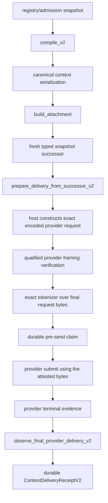

<!-- GENERATED FILE: edit MODULE_MANIFEST.json and run scripts/generate_context_compiler_module_docs.py --write. -->
# `context.compiler` technical development guide

## 1. Provenance and state model

- Module: `context.compiler`
- Reviewed base SHA: `a126987b84737dbc2ee2592442a314117bddb4a2`
- Integration branch: `codex/context-compiler-provider-closure-final-20260927`
- Source manifest: `docs/modules/context.compiler/MODULE_MANIFEST.json`
- Canonical manifest SHA-256: `f15a6b933050094662b25c31a1b645072bd7584d985db4263d361e7688280a2f`
- Generator: `scripts/generate_context_compiler_module_docs.py`

### Review baseline

| Dimension | State | Evidence-based interpretation |
|---|---|---|
| Core implementation | **complete** | Review baseline before this closure branch. |
| Product composition | **partial** | Review baseline before this closure branch. |
| V2 provider closure | **incomplete** | Review baseline before this closure branch. |
| Current-head qualification | **absent** | Review baseline before this closure branch. |

### Candidate source state

| Dimension | State | Evidence-based interpretation |
|---|---|---|
| Core implementation | **complete** | V2 compilation, verified admission, compiler-owned canonical serialization, typed snapshot succession, attachment, exact request proof, delivery observation, and deny-all proof objects are implemented. |
| Product composition | **complete** | The registry, hepta-intelligence, Agentd, ext.hepta-prompt, Core, and codex-api compose one fail-closed exact-body path; the physical send is released only after durable pre-send evidence exists. |
| V2 provider closure | **complete** | The exact encoded provider body is framed by a qualified provider/model policy, tokenized by a binary/vocabulary identity bound to the model profile, submitted without reconstruction, and reconciled into a durable ContextDeliveryReceiptV2. |
| Current-head qualification | **absent** | Source state never self-asserts qualification. Only a successful immutable receipt whose headSha equals the reviewed Git commit changes the external qualification judgment. |

The four dimensions are intentionally independent. Source-complete composition does not self-grant
release qualification, deployment authority, provider credentials, or acceptance authority. The
checked-in truth therefore keeps `currentHeadQualification: absent`; only the external exact-head
receipt may establish that fact for one immutable commit.

## 2. Scope and trust boundary

`context.compiler` selects admitted context under a deterministic token budget, verifies the
realized bytes, emits a compiler-owned canonical context bundle, revalidates a monotone admission
snapshot immediately before physical dispatch, proves the exact encoded provider request, and
maps verified provider terminal evidence into a durable `ContextDeliveryReceiptV2`.

The module does **not** own provider credentials, network authority, model execution, deployment
approval, or release acceptance. Admission verifiers, provider framing policies, exact tokenizers,
and provider terminal verifiers are qualified host capabilities. Their absence or an identity
mismatch fails closed. Registered candidate token costs may guide deterministic selection, but they
are never accepted as proof of the final provider request token count.

## 3. Authoritative source map

- `codex-rs/hepta-context-compiler/src/provider_closure.rs`
- `codex-rs/hepta-context-compiler/src/v2.rs`
- `codex-rs/hepta-intelligence/src/prompt_delivery.rs`
- `codex-rs/hepta-intelligence/src/prompt_delivery_tests.rs`
- `codex-rs/hepta-agentd/src/exact_context_delivery.rs`
- `codex-rs/ext/hepta-prompt/src/exact_body.rs`
- `codex-rs/ext/hepta-prompt/src/lib.rs`
- `codex-rs/codex-api/src/encoded_body_observer.rs`
- `codex-rs/codex-api/src/endpoint/responses.rs`
- `codex-rs/core/src/client.rs`
- `codex-rs/core/src/model_provider_policy`
- `codex-rs/hepta-codex-adapter/src/lib.rs`

Strict product surface:

- `compile_prompt_registry_v2`
- `record_canonical_context_bundle_v2`
- `build_attachment`
- `verify_admission_snapshot_successor_typed_v2`
- `prepare_delivery_from_successor_v2`
- `prove_final_provider_request_v2`
- `FinalRequestFramingVerifierV2`
- `ExactFinalRequestTokenizerV2`
- `observe_final_provider_delivery_v2`
- `AgentdExactContextDeliveryOwner`

Construction-closed proof objects:

- `VerifiedAdmissionSnapshotV2`
- `VerifiedAdmissionSnapshotSuccessorV2`
- `ContextCompilationReceiptV2`
- `ContextAttachmentV2`
- `ContextDeliveryPreparationV2`
- `FinalRequestTokenizerIdentityV2`
- `FinalRequestTokenizationReceiptV2`
- `FinalProviderRequestProofV2`
- `ContextDeliveryReceiptV2`

## 4. End-to-end provider-bound sequence

```mermaid
flowchart TD
    N0["registry/admission snapshot"]
    N1["compile_v2"]
    N0 --> N1
    N2["canonical context serialization"]
    N1 --> N2
    N3["build_attachment"]
    N2 --> N3
    N4["fresh typed snapshot successor"]
    N3 --> N4
    N5["prepare_delivery_from_successor_v2"]
    N4 --> N5
    N6["host constructs exact encoded provider request"]
    N5 --> N6
    N7["qualified provider framing verification"]
    N6 --> N7
    N8["exact tokenizer over final request bytes"]
    N7 --> N8
    N9["durable pre-send claim"]
    N8 --> N9
    N10["provider submit using the attested bytes"]
    N9 --> N10
    N11["provider terminal evidence"]
    N10 --> N11
    N12["observe_final_provider_delivery_v2"]
    N11 --> N12
    N13["durable ContextDeliveryReceiptV2"]
    N12 --> N13
```

The order is security-significant:

1. The selected registry projection is serialized by the compiler, not by an arbitrary caller.
2. The fresh typed snapshot successor is obtained immediately before final use.
3. The provider host finishes canonical request construction before exact tokenization.
4. A qualified provider/model framing verifier accepts all non-context request bytes.
5. Agentd durably claims the exact attempt before transport receives the body.
6. Terminal evidence is reconciled against the same preparation and final-request proof.

## 5. Byte and digest identity model

| Object | Owner | Exact material | Digest / witness | Security meaning |
|---|---|---|---|---|
| canonical context bundle | context.compiler | Compiler-owned JSON envelope containing selected realized items, explicit roles, IDs, content digests, and exact content. | `ContextSerializationReceiptV2.payload_digest` | The selected context is deterministic and cannot be replaced by a caller-supplied prepared payload on the strict product path. |
| prompt fragments | hepta-intelligence / ext.hepta-prompt | Typed product projection inserted into the host request builder. | `PromptRuntimeAttachmentV1.source_binding_digest` | Useful for product composition and migration, but never accepted as proof of the final provider body. |
| provider final request | codex-api encoded-body boundary | Exact canonical JSON bytes after all provider/model request construction and before compression or signing. | `FinalProviderRequestProofV2.provider_request_digest` | The qualified tokenizer, framing verifier, durable pre-send claim, and physical HTTP send all consume this same byte string. |
| provider wire semantic digest | Core model-provider policy | Secret-free canonical semantics of the physical provider attempt, including provider, endpoint, transport, model, request kind, and logical input binding. | `ModelProviderInvocationInput.wire_semantic_sha256` | Binds transport semantics and terminal evidence; it is intentionally distinct from the byte-for-byte final-request digest. |

These identities must never be collapsed:

- **Canonical context bundle** proves the compiler-selected context bytes.
- **Prompt fragments** are a product projection and migration aid.
- **Provider final request** is the exact encoded HTTP body before compression or signing.
- **Wire semantic digest** binds secret-free transport semantics and terminal accounting.

The final request proof carries complete contiguous segment coverage, exactly one canonical context
segment, qualified framing identity, the byte digest, the wire-semantic digest, and an exact
tokenization receipt. A semantic digest is not a substitute for a byte digest; a fragment digest is
not a substitute for either.

## 6. Security invariants

- The strict serializer is compiler-owned; product callers cannot certify arbitrary prepared payload bytes.
- Every final request contains exactly one canonical context bundle and all remaining bytes are accepted only by a qualified provider/model framing verifier.
- Tokenizer identity binds provider, model, declared profile tokenizer, executable digest, version digest, vocabulary digest, and normalization-policy digest.
- The exact encoded body observed before transport is the tokenizer input and the physical HTTP body; no post-proof reconstruction is permitted.
- Delivery preparation consumes a typed monotone snapshot successor whose predecessor is the attachment-bound snapshot.
- A pre-send record is durably persisted before the exact request is released to transport.
- An unresolved durable pre-send survives restart and blocks blind replay; terminal retries are idempotent only for an identical normalized terminal observation.
- Provider terminal evidence binds the provider intent, wire-semantic digest, final-request proof, preparation, and deny-all authority receipt.

### 6.1 Compiler-owned canonical serialization

The strict path calls `record_canonical_context_bundle_v2`. Selected item IDs, roles, content
digests, and exact UTF-8 content are encoded in a deterministic compiler-owned envelope. The
legacy generic serializer trait can remain for compatibility and testing, but product V2 closure
does not certify a caller-provided prepared payload.

### 6.2 Qualified provider framing

Complete byte coverage alone is insufficient: it can show where the context occurs without proving
that the other bytes belong to an allowed provider grammar. `FinalRequestFramingVerifierV2`
therefore validates the exact JSON request, provider/model binding, typed model-input fields, and a
one-and-only-one decoded context occurrence. Its identity digest is included in
`FinalProviderRequestProofV2`.

### 6.3 Exact final-request tokenization

`FinalRequestTokenizerIdentityV2` binds:

- provider identity;
- provider model identity;
- declared profile tokenizer;
- tokenizer executable digest;
- tokenizer version digest;
- vocabulary digest;
- normalization-policy digest.

Agentd hashes the configured executable and vocabulary, invokes the tokenizer as a bounded child
process, writes the exact encoded request to standard input, accepts only a strict positive decimal
count, and binds that result to the exact request digest. Estimates, candidate-cost sums, and
post-hoc provider usage are not accepted as pre-dispatch budget proof.

### 6.4 Typed snapshot succession

`VerifiedAdmissionSnapshotSuccessorV2` binds the attachment snapshot as predecessor and rejects
time rollback, revocation-epoch rollback, authority-domain changes, stale observations, and revoked
admission resurrection. `prepare_delivery_from_successor_v2` consumes this typed lineage object
rather than an unrelated freshly verified snapshot.

### 6.5 Durable dispatch and crash recovery

The exact-body observer runs after canonical JSON encoding and before compression/signing. Agentd
performs final-use revalidation, framing verification, tokenization, and an atomic durable pre-send
claim before the callback returns and transport may send the body. The send uses the same encoded
body object; rebuilding from fragments after proof is prohibited.

A durable pre-send without a terminal remains **indeterminate** after restart and blocks blind
replay. A terminal callback is idempotent only when its normalized terminal observation digest
matches the durable receipt. A different terminal for the same attempt is a conflict, not a retry.

### 6.6 Provider terminal evidence

Provider intent binds thread, turn, attempt, provider configuration, model, endpoint, request kind,
transport, logical request, wire semantics, and optional ephemeral input witnesses. Terminal
evidence is accepted only against the active preparation and final-request proof, then persisted as
a deny-all `ContextDeliveryReceiptV2`.

## 7. Failure model

Strict APIs fail closed for, among other cases:

- missing, stale, reset, rollback, or revoked admission state;
- selected-byte mismatch, duplicate realization, or oversized content;
- arbitrary serializer output on the strict product path;
- absent, ambiguous, duplicated, gapped, overlapping, or unqualified final-request segments;
- provider/model/tokenizer/framing identity mismatch;
- tokenizer absence, timeout, malformed output, zero count, or budget overflow;
- failure to durably claim the attempt before send;
- unresolved pre-send recovery, duplicate-attempt conflict, or terminal mismatch;
- provider evidence that does not bind the exact admitted attempt.

There is no approximate-token fallback and no V1 receipt accepted as V2 closure evidence.

## 8. Test strategy

- canonical serializer golden and adversarial prepared-payload rejection
- Unicode, embedded control bytes, large request, and exact JSON escaping
- segment-map gaps, overlaps, duplicate context, wrong model, and unqualified framing
- tokenizer binary/version/vocabulary/normalization/profile identity mismatch
- real subprocess tokenizer receiving the exact Unicode/control-byte provider body
- snapshot reset, time rollback, revocation-epoch rollback, and revocation resurrection
- crash/reopen unresolved pre-send blocking, retry idempotency, and terminal conflict
- registry → compiler → exact encoded body → provider terminal → durable receipt integration
- property-generated deterministic coverage and mutation fail-closed corpus

Property tests exercise deterministic complete coverage and fail-closed mutations over generated
request shapes. Golden tests include Unicode, JSON escapes, control bytes, large payloads, and a real
subprocess tokenizer fixture. Product tests cover registry compilation, immediate revocation,
exact-body observation, crash recovery, terminal idempotency, and durable receipt reconciliation.

## 9. Exact-head qualification

Workflow: `.github/workflows/context-compiler-qualification.yml`

Receipt artifact: `context-compiler-qualification-receipt-<head-sha>`

Required command set:

- `python3 scripts/generate_context_compiler_module_docs.py --check`
- `cargo fmt --all -- --check`
- `cargo test --locked -p codex-hepta-context-compiler`
- `cargo test --locked -p codex-hepta-intelligence prompt_delivery`
- `cargo test --locked -p codex-hepta-prompt-extension exact_body`
- `cargo test --locked -p codex-hepta-agentd exact_context_delivery`
- `cargo check --locked for codex-api/core/compiler/intelligence/prompt/agentd`
- `cargo clippy --locked for all affected crates and all targets with -D warnings`
- `cargo deny --locked check bans licenses sources`
- `cargo deny --locked check advisories (recorded non-blocking repository audit)`
- `bazel test //codex-rs/hepta-context-compiler:all`
- `python3 scripts/hepta-readiness.py verify`
- `python3 scripts/hepta-docs.py verify`

The workflow checks out the exact candidate SHA, records every command, exit code, duration and log
digest, hashes this manifest and all generated truth files, verifies a clean worktree, and uploads the
receipt even when a command fails. The artifact name contains the head SHA. Historical green runs
or source presence do not qualify a different commit.

## 10. Operational requirements and open items

- Exact-head qualification remains absent in source until the external workflow publishes a passing receipt bound to that Git SHA.
- Deployment must provision an approved tokenizer executable, vocabulary, provider/model identity, normalization policy, and profile digest; missing or mismatched capabilities fail closed.
- Historical V1 receipt data may be retained for migration and audit, but it is not accepted as V2 provider-closure evidence.

## 11. Change discipline

Edit `MODULE_MANIFEST.json`, regenerate all three truth artifacts, and commit them together. Direct
manual edits to this file, `IMPLEMENTATION_MAP.json`, or the execution dossier are rejected by the
qualification gate. Any change to the provider encoder, tokenizer ABI, framing policy, snapshot
authority, durable state schema, or terminal mapping requires a new exact-head receipt.
