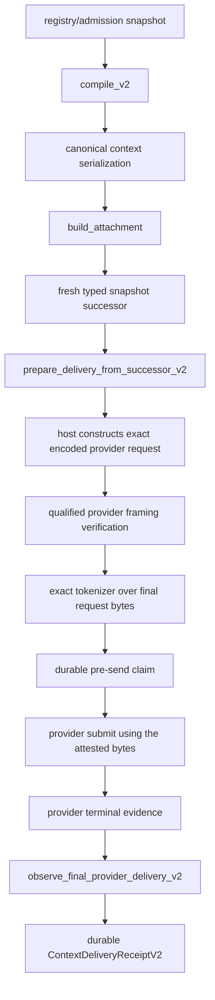

<!-- GENERATED FILE: edit MODULE_MANIFEST.json and run scripts/generate_context_compiler_module_docs.py --write. -->
# Execution dossier: `context.compiler`

## 1. Evidence identity

- Reviewed base SHA: `a126987b84737dbc2ee2592442a314117bddb4a2`
- Integration branch: `codex/context-compiler-provider-closure-final-20260927`
- Manifest SHA-256: `f15a6b933050094662b25c31a1b645072bd7584d985db4263d361e7688280a2f`
- Generator: `scripts/generate_context_compiler_module_docs.py`
- Qualification workflow: `.github/workflows/context-compiler-qualification.yml`
- Receipt artifact: `context-compiler-qualification-receipt-<head-sha>`

## 2. State transition

### Review baseline

| Dimension | State | Evidence-based interpretation |
|---|---|---|
| Core implementation | **complete** | Review baseline before this closure branch. |
| Product composition | **partial** | Review baseline before this closure branch. |
| V2 provider closure | **incomplete** | Review baseline before this closure branch. |
| Current-head qualification | **absent** | Review baseline before this closure branch. |

### Candidate source state

| Dimension | State | Evidence-based interpretation |
|---|---|---|
| Core implementation | **complete** | V2 compilation, verified admission, compiler-owned canonical serialization, typed snapshot succession, attachment, exact request proof, delivery observation, and deny-all proof objects are implemented. |
| Product composition | **complete** | The registry, hepta-intelligence, Agentd, ext.hepta-prompt, Core, and codex-api compose one fail-closed exact-body path; the physical send is released only after durable pre-send evidence exists. |
| V2 provider closure | **complete** | The exact encoded provider body is framed by a qualified provider/model policy, tokenized by a binary/vocabulary identity bound to the model profile, submitted without reconstruction, and reconciled into a durable ContextDeliveryReceiptV2. |
| Current-head qualification | **absent** | Source state never self-asserts qualification. Only a successful immutable receipt whose headSha equals the reviewed Git commit changes the external qualification judgment. |

The transition from partial/incomplete to source-complete is justified by the exact encoded-body
observer, compiler-owned serialization, qualified framing, real tokenizer execution, durable
pre-send fencing, provider terminal reconciliation, and crash-recovery tests. Qualification remains
absent until a receipt for the exact candidate SHA is green.

## 3. Implemented controls

- The strict serializer is compiler-owned; product callers cannot certify arbitrary prepared payload bytes.
- Every final request contains exactly one canonical context bundle and all remaining bytes are accepted only by a qualified provider/model framing verifier.
- Tokenizer identity binds provider, model, declared profile tokenizer, executable digest, version digest, vocabulary digest, and normalization-policy digest.
- The exact encoded body observed before transport is the tokenizer input and the physical HTTP body; no post-proof reconstruction is permitted.
- Delivery preparation consumes a typed monotone snapshot successor whose predecessor is the attachment-bound snapshot.
- A pre-send record is durably persisted before the exact request is released to transport.
- An unresolved durable pre-send survives restart and blocks blind replay; terminal retries are idempotent only for an identical normalized terminal observation.
- Provider terminal evidence binds the provider intent, wire-semantic digest, final-request proof, preparation, and deny-all authority receipt.

## 4. Product-path finding

The product path is no longer a parallel V1 reconstruction:

The codex-api endpoint encodes the canonical JSON body once. The observer receives that exact byte
buffer, Agentd completes fresh final-use verification and durable proof, and the endpoint submits
the same encoded object. The terminal callback carries the exact provider attempt into
`observe_final_provider_delivery_v2` and the durable V2 receipt store.

## 5. Byte-identity audit

| Object | Owner | Exact material | Digest / witness | Security meaning |
|---|---|---|---|---|
| canonical context bundle | context.compiler | Compiler-owned JSON envelope containing selected realized items, explicit roles, IDs, content digests, and exact content. | `ContextSerializationReceiptV2.payload_digest` | The selected context is deterministic and cannot be replaced by a caller-supplied prepared payload on the strict product path. |
| prompt fragments | hepta-intelligence / ext.hepta-prompt | Typed product projection inserted into the host request builder. | `PromptRuntimeAttachmentV1.source_binding_digest` | Useful for product composition and migration, but never accepted as proof of the final provider body. |
| provider final request | codex-api encoded-body boundary | Exact canonical JSON bytes after all provider/model request construction and before compression or signing. | `FinalProviderRequestProofV2.provider_request_digest` | The qualified tokenizer, framing verifier, durable pre-send claim, and physical HTTP send all consume this same byte string. |
| provider wire semantic digest | Core model-provider policy | Secret-free canonical semantics of the physical provider attempt, including provider, endpoint, transport, model, request kind, and logical input binding. | `ModelProviderInvocationInput.wire_semantic_sha256` | Binds transport semantics and terminal evidence; it is intentionally distinct from the byte-for-byte final-request digest. |

Acceptance is byte-identity based. The canonical bundle, fragments, final request, and wire
semantics remain distinct objects with distinct owners and digest domains.

## 6. Crash, retry, and terminal audit

- Pre-send evidence is persisted and fsynced before transport release.
- A process restart does not reconstruct authority from a stored digest.
- An unresolved durable pre-send blocks blind replay for the attempt and turn.
- A repeated terminal callback is idempotent only for an identical normalized observation.
- A conflicting terminal or re-armed terminal attempt fails closed.
- Durable state is bounded, schema-checked, private, locked, atomically replaced, and directory
  synced.

## 7. Expected exact-head test evidence

- canonical serializer golden and adversarial prepared-payload rejection
- Unicode, embedded control bytes, large request, and exact JSON escaping
- segment-map gaps, overlaps, duplicate context, wrong model, and unqualified framing
- tokenizer binary/version/vocabulary/normalization/profile identity mismatch
- real subprocess tokenizer receiving the exact Unicode/control-byte provider body
- snapshot reset, time rollback, revocation-epoch rollback, and revocation resurrection
- crash/reopen unresolved pre-send blocking, retry idempotency, and terminal conflict
- registry → compiler → exact encoded body → provider terminal → durable receipt integration
- property-generated deterministic coverage and mutation fail-closed corpus

The exact-head receipt must include the command line, working directory, exit status, duration, log
SHA-256, source/tree identity, toolchain versions, truth-file hashes, and clean-worktree result for
every required command.

## 8. Remaining operational conditions

- Exact-head qualification remains absent in source until the external workflow publishes a passing receipt bound to that Git SHA.
- Deployment must provision an approved tokenizer executable, vocabulary, provider/model identity, normalization policy, and profile digest; missing or mismatched capabilities fail closed.
- Historical V1 receipt data may be retained for migration and audit, but it is not accepted as V2 provider-closure evidence.

## 9. Reviewer decision

The source candidate closes the previously identified serializer, framing, tokenizer, snapshot
lineage, physical-send, crash-retry, and terminal-receipt gaps. It is suitable for protected-branch
review. It is **not** represented as release-qualified until the external exact-head artifact passes
and branch-required CI and architecture checks are green.
