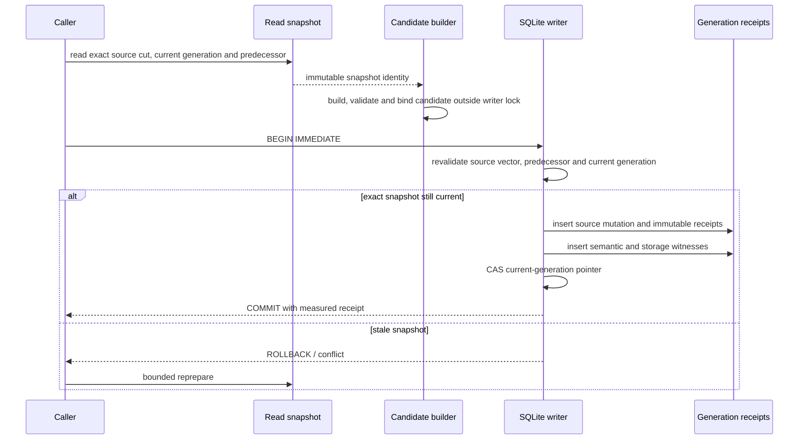

# knowledge.graph operations and qualification

This document records the operational boundary of the current `knowledge.graph`
candidate. It is descriptive and fail-closed: it does not establish independent
acceptance, activation, promotion, release, or a host-independent service level.

## 1. Immutable identity layers

| Layer | Required identity | Meaning | Drift response |
|---|---|---|---|
| Source candidate | exact commit and tree | reviewed authoring source | invalidate every later receipt |
| Qualification checkout | exact tested commit, tree, parents and lane | source-head, deterministic base-merge, or comparison checkout | do not combine lanes or attempts |
| Merge candidate | exact base plus deterministic merge commit/tree | compatibility with the selected base | rebuild after base movement |
| Evidence artifact | workflow/harness blobs, log hashes and artifact digest | immutable execution record for one lane and attempt | reject missing, skipped, cancelled, zero-test or mixed-attempt evidence |
| Final merge | exact protected-branch commit/tree | post-merge source identity | requires a separate post-merge receipt |

`CURRENT_STATUS.json`, `CURRENT_STATUS.md`, and `IMPLEMENTATION_MAP.json` are
source-navigation declarations. They are never substitutes for execution
artifacts. Until all required exact-head and deterministic-merge lanes are green,
`productionImplementation`, `productExecutionProved`, independent acceptance,
activation and release remain false.

## 2. SQLite migration matrix

| Migration | Contract | Compatibility and recovery boundary |
|---|---|---|
| `0013_kg_generation_semantics.sql` | Adds immutable source, generation-vector, graph-profile, generation and publication digests. A current pointer may advance only after the semantic receipt exists. | Older generations remain readable history. A post-migration current generation must have a canonical semantic receipt. Update and delete are rejected. |
| `0014_kg_incremental_generation_storage.sql` | Adds immutable `revision_facts_v1` storage witnesses, count-match enforcement and revision-scoped FTS. New generations no longer copy complete node/edge tables. | Pre-G14 complete generations remain historical compatibility data. New current generations require either the compact witness or the complete legacy materialization proven by counts. |

Migration checks bind the binary, `Cargo.lock`, both migration blobs and the
opened database. A failed migration leaves the predecessor recoverable; no repair
may silently manufacture a receipt.

## 3. Exact callers and feature posture

| Caller/path | Feature posture | Current selection |
|---|---|---|
| Agentd scoped cognitive mutation | `production-cognitive-write` is the Agentd-crate default | Named product candidate; ordinary Codex/App Server binaries remain default-off |
| Agentd qualification witness | `qualification-cognitive-write` | Adds observation only; grants no mutation authority |
| Cognitive SQLite full rebuild writer | existing owner transaction | Compatibility/oracle path remains available |
| Prepared cognitive writer | read snapshot, off-lock build, short revalidated writer transaction | Candidate API and tests exist; no default caller is switched by implication |
| Prompt factor graph | registry-owned source, KG projection, optimizer read | Read-only and generation-bound; no authority is minted |
| Unbounded graph query | explicit reference/oracle entry | Trusted migration/equivalence use only, never the external product surface |

## 4. Prepared publication sequence

Operation metrics keep snapshot read, predecessor reconstruction,
build/validation, writer-lock wait, writer-lock hold, CAS conflicts and retry count
separate. Preparation may move outside the lock; source mutation, immutable
receipts and current-pointer advancement remain one transaction.

## 5. Crash-window state model

```mermaid
stateDiagram-v2
    [*] --> PredecessorCurrent
    PredecessorCurrent --> PreparedOnly: candidate prepared outside transaction
    PreparedOnly --> WriterOpen: BEGIN IMMEDIATE and revalidation succeeds
    WriterOpen --> ReceiptsInserted: source facts and immutable receipts inserted
    ReceiptsInserted --> PointerAdvanced: CAS current pointer
    PointerAdvanced --> Committed: COMMIT
    PreparedOnly --> PredecessorCurrent: stale plan or cancellation
    WriterOpen --> PredecessorCurrent: rollback or process death
    ReceiptsInserted --> PredecessorCurrent: rollback or process death
    PointerAdvanced --> PredecessorCurrent: process death before durable commit
    Committed --> [*]
```

On reopen, a committed operation exposes the exact successful memory head,
generation digest and predecessor-bound publication digest. Every pre-commit
crash exposes only the predecessor; tentative facts, receipts and pointers must
not survive. Physical power-loss behavior requires separate target-storage
acceptance and is not inferred from process-kill/SQLite-WAL tests.

## 6. Capacity and target-host acceptance

The versioned V2 kernel currently measures in-policy points at 4,096 nodes / 32,768
edges and 32,768 nodes / 262,144 edges. Requests for 100,000 nodes or 1,000,000
edges remain explicit policy rejections; qualification must not silently widen
resource limits. A selected target-host profile predeclares CPU, memory, storage,
filesystem, SQLite settings and acceptance budgets before measuring.

Record build, verified-view construction, bounded query, local prepare, local
apply, reopen, writer lock wait/hold, contention, database/WAL bytes, RSS and CPU
observations with p50/p95/p99 where repeated sampling is meaningful. Hosted-runner
observations are diagnostic only. No production SLO exists until an independent
operator accepts a named target profile.

## 7. Query-plan and resource gates

`codex-rs/hepta-memory/tests/kg_prepared_and_plans.rs` is the durable query-plan
contract. Selected hot queries retain their intended indexes and fail the gate on
unexpected full scans or temporary sort/storage plans. Query results are bounded
simultaneously by semantic cardinality, support-work budget, output canonical-cost
bytes, deadline and cancellation. Budget, deadline, cancellation, stale source cut
and semantic errors remain distinct; exhaustion returns no partial success or
inexact omission count.

## 8. Operational signals and actions

| Signal | Required action |
|---|---|
| oldest unqualified candidate/receipt age | block promotion; identify the missing exact lane or artifact |
| writer-lock wait and hold distributions | separate contention from preparation cost; do not hide both in total latency |
| CAS conflicts and bounded retries | investigate source churn; stop after the configured retry limit |
| rebuild and predecessor-reconstruction work | compare against changed-frontier work before selecting V3 |
| local V3 frontier reads, leaf updates and rehashed treap nodes | detect accidental whole-graph work |
| cache build, wait, hit, miss, eviction and duplicate-build counts | verify singleflight and memory-pressure behavior |
| query budget/deadline/cancellation counts | tune callers without converting resource failure into empty success |
| reopen, tamper and publication-chain failures | quarantine the scope and preserve evidence; never auto-repair authority facts |
| database/WAL/RSS growth | compare canonical admission cost with actual host resource use |

Stop immediately on authority drift, source/base drift, receipt mismatch,
unbounded retry, migration uncertainty, corrupt predecessor, missing test
execution, or mixed-attempt evidence. Rollback selects the last independently
qualified binary/schema pair and preserves immutable history for reconciliation.
