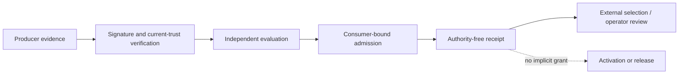
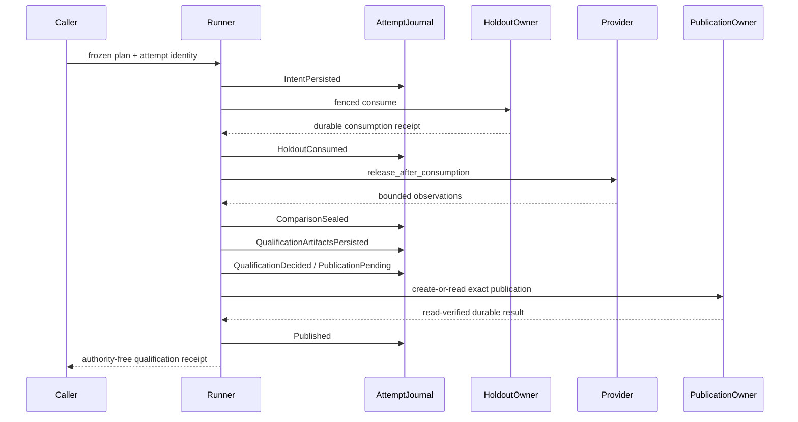
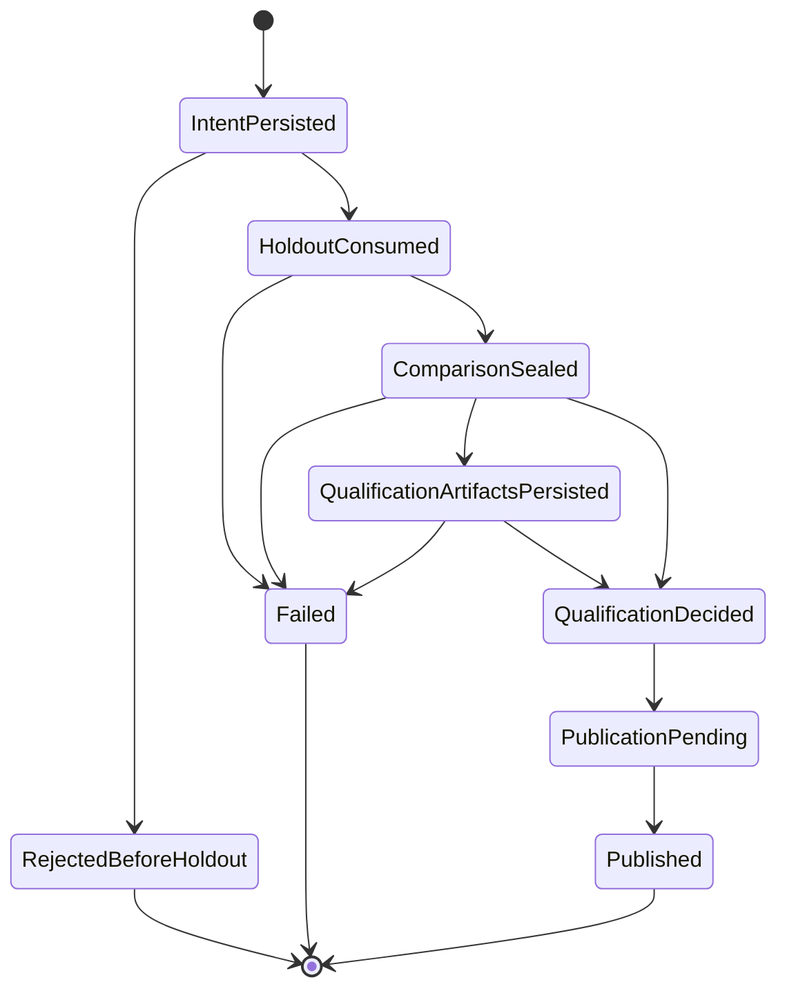

# learning.eval developer guide

This is the human-oriented entry point for `learning.eval`. The normative source
contracts remain in `codex-rs/hepta-intelligence-eval`, while generated inventories,
status projections, and execution evidence are indexed in
[`AUDIT_INDEX.md`](AUDIT_INDEX.md). A source-visible implementation is not target-host
qualification, independent acceptance, activation, promotion, or release authority.

## 1. Mission and non-goals

`learning.eval` performs deterministic, support-aware, longitudinal and causal
qualification independently from the production writer. It freezes evaluation plans,
consumes a final holdout once, verifies signed evidence, persists exact qualification
artifacts, and emits authority-free receipts for downstream review.

It does **not** write production model state, self-issue acceptance, silently retry an
unknown effect, convert eligibility into promotion authority, authenticate an arbitrary
host adapter, or treat a digest commitment as proof that an observation was independently
measured.

## 2. Authority model

All evaluation and recovery receipts are `DENY_ALL`. Selection, activation, promotion,
and release are separate authorities owned outside this module. Direct low-level decision
functions are crate-private in default builds. The `trusted-inprocess-eval` feature exists
only for the isolated compatibility fixture and must not appear in a product dependency
manifest.

## 3. Product call path

The canonical product path is `RecordedProductEvaluationRunnerV1` over a
`FencedFinalHoldoutOwnerV1` and a `DurableProductEvaluationAttemptJournalV1`.
`IntentPersisted` precedes provider lookup and holdout use. The provider releases
observations only after `HoldoutConsumed` has been acknowledged. Qualification uses
signed V2/V3 evidence and exact typed archives; publication is complete only after the
external publication owner is read back and the exact nonzero result is observed.

## 4. State machine

A new attempt owns one plan digest. Reusing that plan under another attempt conflicts.
An existing attempt is never automatically re-executed; recovery reads the authoritative
journal and external owners.

## 5. Persistence and recovery

The file journal uses bounded framed append, checksums, a predecessor/state digest,
exclusive locking, `sync_all`, streaming replay, and an independently retained anchor.
Unknown writes poison the handle. Recovery rejects rollback behind the retained anchor,
never truncates a damaged tail silently, and never erases final-holdout consumption.
Checkpoint recovery is separately anchored and may reduce replay work without replacing
the authoritative journal frontier.

Crash handling is fail-closed:

| Crash point | Durable fact | Required recovery action |
|---|---|---|
| before intent | no attempt | caller may start a new attempt |
| after intent | intent only | inspect owner state; never blindly execute |
| after holdout consumption | consumption may be final | reconcile journal and holdout owner |
| after comparison | sealed execution | reload exact typed artifacts |
| after qualification decision | decision durable | re-verify current trust before publication |
| after publication pending | effect may be unknown | read publication owner; do not duplicate write |
| response lost after commit | publication owner is authoritative | observe exact existing result, then append `Published` |
| anchor acknowledgement uncertain | wrapper poisoned | reopen from file plus independent anchor authority |

A real deployment must additionally qualify directory durability, mount options,
linearizable lock/CAS semantics, power-loss behavior, and failure-domain independence.

## 6. Statistical contract

Plans bind the objective, dataset, folds, estimand, metric roles, support rules, temporal
windows, cluster assignments, and confidence procedure. Fixed-analysis qualification does
not import adaptive thresholds after holdout use. Multi-outcome evaluation preserves each
native measurement channel; renaming a metric cannot substitute for independent measured
outcomes. Real future-window provenance, power, subgroup, retention, privacy, poisoning,
negative transfer, and unlearning evidence remain external qualification obligations.

## 7. Failure taxonomy

Operational outcomes preserve rejected, unavailable, indeterminate, poisoned, conflict,
and terminal failure. Durable product-evaluation failure identity uses the versioned
`hepta.learning-eval.product-evaluation-failure.v2` class/detail encoding. It does not hash
Rust `Debug` output. Existing V1 terminal digests remain opaque historical facts and are
not rewritten during replay.

Human diagnostics may carry additional bounded context, but the durable preimage contains
only registered numeric semantics. Unknown diagnostic text maps to an unspecified detail
rather than silently becoming a compatibility contract.

## 8. Deployment topology

The selected-host facade requires four independently identified capabilities:

1. an authenticated target-host identity and topology declaration;
2. an independently administered linearizable anchor authority;
3. the real final-outcome provider or measurement custodian;
4. the real durable publication owner.

Repository source defines these contracts and recovery composition. It does not nominate
an external instance as approved merely because it implements a Rust trait. Current
adapter identities and host attestations are intentionally `UNBOUND_EXTERNAL` in
[`QUALIFICATION_MATRIX.json`](QUALIFICATION_MATRIX.json), so `targetHostQualified` remains
false.

## 9. Qualification checklist

A reviewable immutable candidate requires all of the following on one SHA:

- source identity and implementation-map validation;
- default API compile plus compile-fail rejection of raw product ingress;
- isolated compatibility fixture execution;
- owner, consumer, process-fault, recovery, capacity and checkpoint tests;
- strict Clippy and rustfmt;
- coverage at or above the registered threshold;
- exact source-head execution;
- ordered-parent synthetic-merge execution;
- retained commit-addressed logs and evidence digests.

The exact workflow runs every filtered qualification test through
`scripts/hepta-nextest-require.py`; fewer than the declared minimum matches is a hard
failure. Source and exact evidence update separate machine-owned PR markers and never set
external acceptance or release claims.

## 10. Known gaps

The repository cannot self-create the remaining external facts. Before production
acceptance, independently administered infrastructure must provide and sign:

- selected-host, anchor, provider and publication-store identities;
- crash/power-loss and filesystem qualification on the declared topology;
- sustained capacity, checkpoint rotation, cold-start, backlog and recovery SLO evidence;
- real future-calendar outcome provenance and statistical operating characteristics;
- privacy, poisoning, negative-transfer, retention and unlearning evidence;
- independent semantic/operator acceptance and separate promotion/release authority.

Until those facts exist, the PR remains Draft and the release posture remains `NO_GO`.
