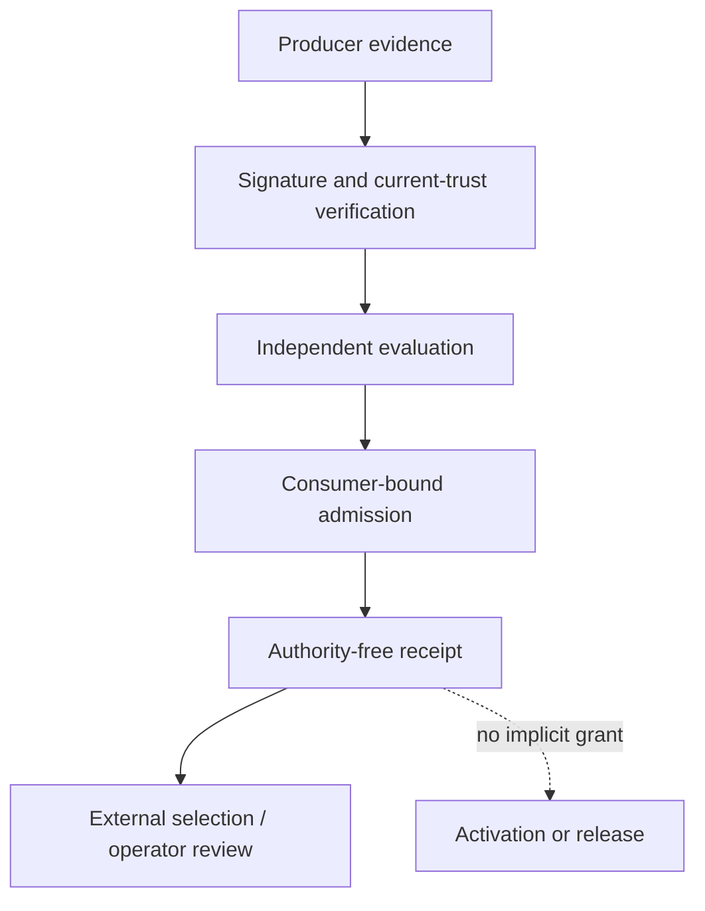
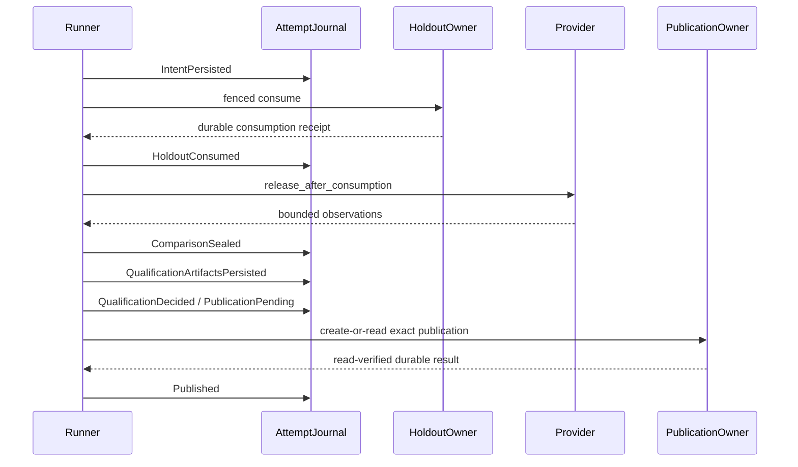
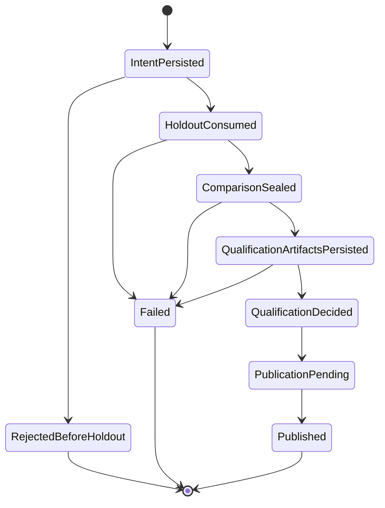

# learning.eval developer guide

This is the human-oriented entry point for `learning.eval`. Normative source contracts
remain in `codex-rs/hepta-intelligence-eval`; generated inventories, status projections,
and commit-addressed execution evidence are indexed in
[`AUDIT_INDEX.md`](AUDIT_INDEX.md). Source presence, repository CI, and an eligibility
receipt are not target-host qualification, independent acceptance, activation,
promotion, or release authority.

## 1. Mission and non-goals

`learning.eval` performs deterministic, support-aware, longitudinal, and causal
qualification independently from the production writer. It freezes evaluation plans,
consumes a final holdout once, verifies signed evidence, persists exact qualification
artifacts, and emits authority-free receipts for downstream review.

It does **not** write production model state, self-issue acceptance, silently retry an
unknown effect, convert eligibility into promotion authority, authenticate an arbitrary
host adapter, or treat a digest commitment as proof that an observation was independently
measured. Repository workflows also do not turn source checks into target-host or release
claims.

## 2. Authority model

All evaluation and recovery receipts are `DENY_ALL`. Selection, activation, promotion,
and release are separate authorities owned outside this module. Direct low-level decision
functions are crate-private in default builds. The `trusted-inprocess-eval` feature exists
only for the isolated compatibility fixture and must not appear in a product dependency
manifest.

The repository CI authority model is similarly split. Candidate source executes only in
read-only workflows. PR-body mutation is delegated to a trusted default-branch
`workflow_run` reporter that never executes the candidate checkout and never treats an
artifact as trusted merely because GitHub stored it.

## 3. Product call path

The canonical product path is `RecordedProductEvaluationRunnerV1` over a
`FencedFinalHoldoutOwnerV1` and a `DurableProductEvaluationAttemptJournalV1`.
`IntentPersisted` precedes provider lookup and holdout use. The provider releases
observations only after `HoldoutConsumed` has been acknowledged. Qualification uses
signed V2/V3 evidence and exact typed archives; publication is complete only after the
external publication owner is read back and the exact nonzero result is observed.

The supported public namespace is `codex_hepta_intelligence_eval::product`. The raw
`ProductEvaluationRunnerV1`, direct decision primitives, and in-memory attempt journal are
not part of that canonical product facade.

The single-outcome receipt evidence domain is
`hepta.intelligence-eval.product-qualification.v4`. Integrity validation binds
every signed-decision field, including disposition, identities and the ordered
failed-metric list. Its outer receipt-seal domain remains v1. A domain-v3
in-memory receipt must be regenerated after verifying the original evaluation
or typed archive; candidate/use signatures over its old evidence digest must
also be reissued. Archive, journal and publication wire formats are unchanged.
Regeneration does not permit another publication of an existing effect.

## 4. State machine

A new attempt owns one plan digest. Reusing that plan under another attempt conflicts.
An existing attempt is never automatically re-executed; recovery reads the authoritative
journal and external owners.

Every transition is attempt-, plan-, phase-, predecessor-, and payload-bound. A repeated
identical transition is idempotent; an identity reused with different semantics is a
conflict. Public product qualification always passes through
`QualificationArtifactsPersisted`; readable historical compatibility records do not
authorize a new product attempt to skip archive persistence.

## 5. Persistence and recovery

The file journal uses bounded framed append, checksums, a predecessor/state digest,
exclusive locking, `sync_all`, streaming replay, and an independently retained anchor.
Unknown writes poison the handle. Recovery rejects rollback behind the retained anchor,
never truncates a damaged tail silently, and never erases final-holdout consumption.
Checkpoint recovery is separately anchored and may reduce replay work without replacing
the authoritative journal frontier.

Crash handling is fail-closed:

| Crash point | Durable fact | Required recovery action |
|---|---|---|
| before intent | no attempt | caller may start a new attempt |
| after intent | intent only | inspect owner state; never blindly execute |
| after holdout consumption | consumption may be final | reconcile journal and holdout owner |
| after comparison | sealed execution | reload exact typed artifacts |
| after qualification decision | decision durable | re-verify current trust before publication |
| after publication pending | effect may be unknown | read publication owner; do not duplicate write |
| response lost after commit | publication owner is authoritative | observe exact existing result, then append `Published` |
| old backup restored | local frames may be valid but stale | reject anything behind the independently retained anchor |
| anchor acknowledgement uncertain | wrapper poisoned | reopen from file plus independent anchor authority |
| fence issuer restarts | prior fence is durable | resume monotonically above the retained anchor |

A real deployment must additionally qualify directory durability, mount options,
linearizable lock/CAS semantics, power-loss behavior, and failure-domain independence.

Immediately before a selected-host first publication write, the guard reloads
the entire archive and compares its byte digest and original holdout-record
digest, then samples current clock/trust and re-verifies the exact decision.
Cold recovery derives the expected identity from validated anchored attempt
history, rather than accepting a fresh digest calculated from replacement disk
contents. An archive or outer holdout substitution after `PublicationPending`
creates no publication and remains unresolved for read reconciliation.

## 6. Statistical contract

Plans bind the objective, dataset, folds, estimand, metric roles, support rules, temporal
windows, cluster assignments, and confidence procedure. Fixed-analysis qualification does
not import adaptive thresholds after holdout use. Multi-outcome evaluation preserves each
native measurement channel; renaming a metric cannot substitute for independent measured
outcomes.

ESS admission uses finite Q32 outward bounds on the original propensity ratios
and, for sequential OPE, their products at every depth. Nearest/ties-to-even
weights and receipt ESS are point diagnostics. Admission requires a proven
lower bound at the frozen floor or exact positive-weight equality proving
`ESS = n` at a floor no greater than `n`. An upper bound can prove insufficient
support; a nonuniform unresolved interval returns `NumericalSupportGap`. It must never be
reported as a proof that true ESS either passes or fails the floor.

At the maximum floor `ESS = n`, identical positive true weights satisfy the
Cauchy equality check even when their probabilities have different encodings.
Sequential equality uses fixed 129-limb buffers for `horizon <= 128`, including
the `2^8192` endpoint; it is an equality proof, not arbitrary exact rational ESS.
See the [production contract](../../../codex-rs/hepta-intelligence-eval/PRODUCTION_CONTRACT.md#ess-certification-from-original-propensities)
for the bound formulas and retained resource caps. Near-floor nonuniform data
can remain a numerical support gap. A strict boundary regression separates two
ESS values by approximately `2.4e-20`; it demonstrates threshold correctness,
not a measurable practical effect or statistical power gain.

Repository tests can establish deterministic estimators, digest binding, fold separation,
capacity, and recovery behavior. Real future-window provenance, statistical power,
subgroup behavior, retention, change points, privacy, poisoning, negative transfer, and
unlearning evidence remain external qualification obligations.

## 7. Failure taxonomy

Operational outcomes preserve rejected, unavailable, timed out, indeterminate, poisoned,
conflict, quarantined, and terminal failure. Durable product-evaluation failure identity
uses the versioned `hepta.learning-eval.product-evaluation-failure.v2` class/detail
encoding. It does not hash Rust `Debug` output. Existing V1 terminal digests remain opaque
historical facts and are not rewritten during replay.

Human diagnostics may carry additional bounded context, but the durable preimage contains
only registered numeric semantics. Unknown diagnostic text maps to an unspecified detail
rather than silently becoming a compatibility contract.

## 8. Deployment topology

The selected-host facade requires four independently identified capabilities:

1. an authenticated target-host identity and topology declaration;
2. an independently administered linearizable anchor authority;
3. the real final-outcome provider or measurement custodian;
4. the real durable publication owner.

Repository source defines these contracts and recovery composition. It does not nominate
an external instance as approved merely because it implements a Rust trait. Current
adapter identities and host attestations are intentionally `UNBOUND_EXTERNAL` in
[`QUALIFICATION_MATRIX.json`](QUALIFICATION_MATRIX.json), so `targetHostQualified` remains
false.

Target-host evidence must bind the exact binary/source candidate, adapter identities,
namespace and authority epochs, mount and lock semantics, independent anchor failure
domain, provider provenance, publication store, and the observed host session.

## 9. Qualification checklist

A reviewable immutable candidate requires all of the following on one SHA:

- source identity and implementation-map validation;
- default API compile plus compile-fail rejection of raw product ingress;
- isolated compatibility fixture execution;
- owner, consumer, process-fault, recovery, capacity, and checkpoint tests;
- strict Clippy and rustfmt;
- coverage at or above the registered threshold;
- exact source-head execution;
- ordered-parent synthetic-merge execution;
- retained commit-addressed logs and canonical evidence digests.

Every filtered qualification test is first discovered with
`scripts/hepta-nextest-require.py`; fewer than the declared minimum matches is a hard
failure. Candidate source and exact-tree workflows use read-only repository permissions,
checkout a literal event-bound SHA, and never receive PR-write or OIDC authority while
executing candidate code.

PR status is a separate trust boundary. The trusted default-branch
`workflow_run` reporter downloads `qualification-summary.json` or
`exact-summary.json` as **untrusted data**, then verifies:

- the exact artifact name and one regular, bounded summary file;
- schema and canonical SHA-256;
- producer repository, workflow run ID, and run attempt;
- candidate commit and tree;
- allowed job/matrix result vocabulary;
- current open PR identity, same-repository head, and exact current head SHA.

Only after those checks may it replace the corresponding machine-owned PR marker. A stale
run cannot overwrite a newer PR head. The reporter checks out the default branch only and
never executes the producer checkout. Provenance attestation is isolated to successful
`push` runs on `main`; pull-request candidate jobs have neither `id-token: write` nor
attestation authority.

## 10. Known gaps

The repository cannot self-create the remaining external facts. Before production
acceptance, independently administered infrastructure must provide and sign:

- selected-host, anchor, provider, and publication-store identities;
- crash/power-loss and filesystem qualification on the declared topology;
- sustained capacity, checkpoint rotation, cold-start, backlog, and recovery SLO evidence;
- real future-calendar outcome provenance and statistical operating characteristics;
- privacy, poisoning, negative-transfer, retention, and unlearning evidence;
- independent semantic/operator acceptance and separate promotion/release authority.

Until those facts exist and every required source/exact check is green on one immutable
candidate, the PR remains Draft and the release posture remains `NO_GO`.

## 11. Adversarial review invariants

The evaluator sits in the qualification plane between authenticated learning
observations/artifacts and the intelligence or plasticity consumers. It emits
evidence with `DENY_ALL`; it does not select artifacts, mutate production learning
state, activate a runtime, or authorize effects. Source implementation, developer
verification, target-host qualification, independent acceptance and release are
separate completion dimensions.

The detailed development material covers the frozen analysis contract, estimator
assumptions, metric roles, signed independence, holdout consumption, seven-phase
attempt lifecycle, typed archives, recovery, capacity, consumers and qualification.
Review that material against the actual executable source; a generated source
inventory is not a test receipt.

The following failure cases must remain regression obligations:

| Failure case | Required behavior |
| --- | --- |
| An exact propensity ratio exceeds the cumulative ceiling but rounds down into it | Admission uses a conservative upper bound independent of point-estimate rounding. |
| Observed returns look bounded while an unobserved admissible trajectory has greater weighted return | Confidence envelopes cover the complete plan-level estimator range, including nuisance predictions and numerical error. A sample maximum cannot establish a Hoeffding range. |
| Subject signatures outlive the root-signed trust distribution | Agentd rejects the expired activation even when the underlying signatures still verify. |
| Archive or journal work advances time after ingress verification | Selected-host publication rechecks the clock, activation and original signed archive at the actual sink boundary. Expiry preserves unresolved history without publishing. |
| A public single-outcome decision header is changed without changing its old evidence digest | The v4 receipt integrity check rejects changed disposition, IDs or failed-metric content/order. |
| Complete archive bytes or only the outer holdout digest are substituted after Pending | Compare the original byte and holdout digests from prepared inputs or validated cold history before any publication. Retain unresolved Pending on rejection. |
| Rounded weights yield an ESS at the floor while true propensity weights differ | Certify original ratios with outward bounds; exact positive-weight equality can establish `ESS = n`, while unresolved nonuniform data returns a numerical support gap. |
| A publicly constructible CAS record encodes a noncanonical journal state | The exact state reproduced by the proposed persisted event must equal the entire candidate record before writing. |
| A valid checkpoint is paired with a different same-length journal prefix | Recovery verifies the original framed prefix digest, event count and byte frontier before restoring reducer state. |
| Complete post-anchor frames remain readable after an unknown sync result | Recovery synchronizes the locked journal before acknowledging its recovered frontier or advancing the independent anchor. |
| A deterministic rejection occurs before any write | The owner remains usable and its durable state is unchanged; accepted-or-unknown writes require reopen and reconciliation. |

API narrowing, parser/identity validation and trusted reporting checks must fail
for the intended reason. Missing imports, stale test expectations, undiscovered
filters, pending workflows and unrelated compiler errors cannot count as passing
qualification.

Performance claims also require the appropriate workload. Checkpoint recovery
still streams and hashes the original prefix; only reducer execution is limited
to the tail. Nonempty holdout histories must be measured independently of
empty-journal fence takeover. The retained v2 registry digest requires whole-set
work, so current wire-compatible recovery is not constant time in record count.
These limits belong in the selected-host capacity evidence and must not be
concealed by small fixtures or renamed as production completion.
