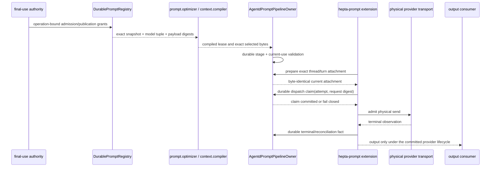
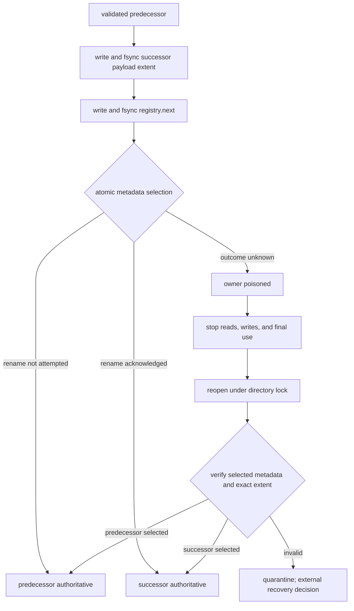
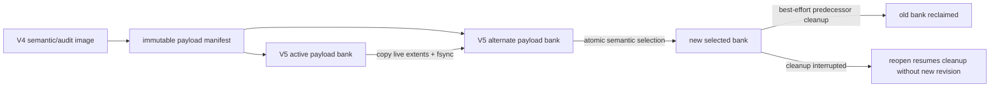

# prompt.registry architecture and traceability

This document visualizes the committed source boundaries. It does not activate a
provider, accept a candidate, or authorize release. Machine-readable source and
qualification identities remain in `IMPLEMENTATION_MAP.json` and the four-lane
receipts.

## Governed prompt path

The committed candidate currently linearizes current-use validation through the
durable dispatch claim. Transport/output checkpointing is a separate capability
and must not be inferred from this diagram until its executable qualification
receipt is present.

## Publication and crash recovery

## V4 semantic state and V5 payload-bank flip

Semantic identities, relations, lifecycle events, grant lineage, and revocation
facts remain in the V4 semantic image. V5 changes physical payload selection and
collection; it does not erase audit history or prove disposal of backups.

## Traceability matrix

| Operation/boundary | Authoritative source | Required executable evidence | Qualification lane |
| --- | --- | --- | --- |
| Register/admit/retire/revoke factor | `hepta-prompt-registry/src/durable.rs` | registry unit and integration tests | core exact-head + base-merge |
| Publish/dereference exact realization | `durable.rs`, `durable_payloads.rs` | payload digest, restart, corruption tests | core exact-head + base-merge |
| Checkpoint/restore/GC | `durable_maintenance.rs`, `durable_gc.rs` | crash, idempotence, retained-history and operational profiles | core exact-head + base-merge |
| Prepare and dispatch current use | `hepta-agentd/src/prompt_runtime.rs` | Agentd final-use and pipeline regressions | product exact-head + base-merge |
| Provider attempt binding | `ext/hepta-prompt/src/lib.rs` | extension attempt/terminal regressions | product exact-head + base-merge |
| Four-lane source qualification | `hepta-prompt-registry-qualification.yml` | four receipts + aggregate content digests | aggregate gate |
| Independent acceptance | `hepta-prompt-registry-acceptance.yml` | protected-environment acceptance artifact | separate independent gate |

Every acceptance artifact must bind the exact source/tree, base and synthetic
merge, workflow SHA, dependency lock digest, runner/target identity, and all four
lane artifact-content digests. A source-authoring workflow or implementation PR
cannot issue that acceptance itself.
