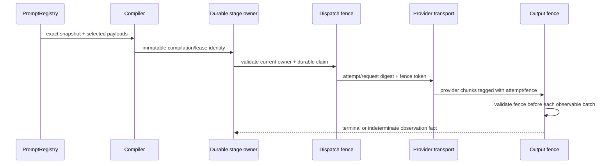
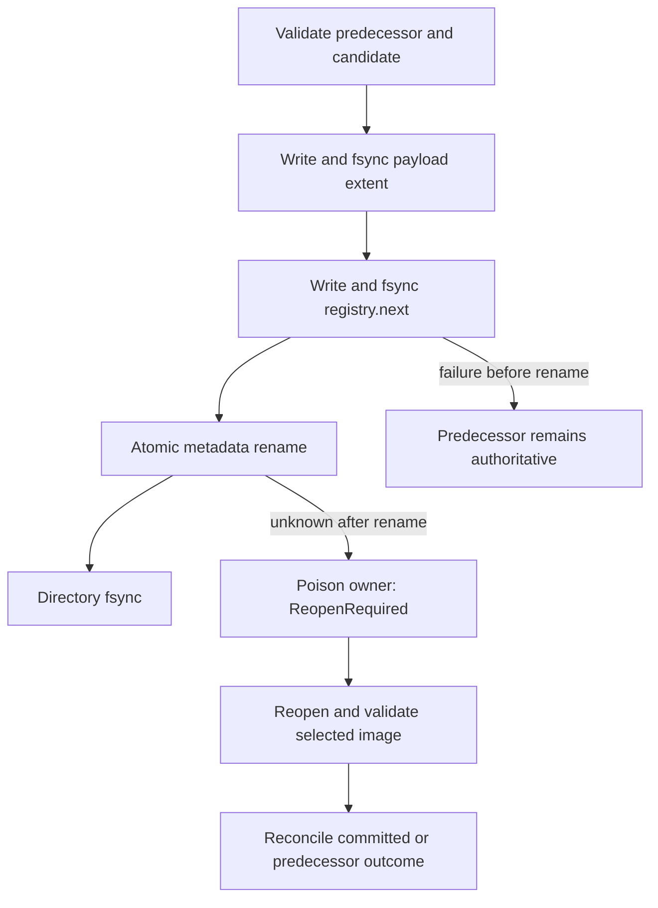
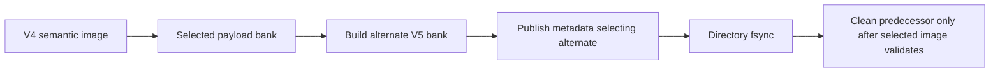

# prompt.registry architecture and evidence diagrams

These diagrams describe the committed source boundaries. They do not claim
activation, independent acceptance, release, secure erasure, or cancellation of
bytes already observed outside the fenced host.

## Governed final-use sequence

## Atomic publication and reopen

## V4/V5 payload-bank handoff

## Qualification traceability

| Operation/evidence | Source | Tests | Qualification lane | Immutable output |
| --- | --- | --- | --- | --- |
| Registry lifecycle and durable GC | `hepta-prompt-registry` | registry unit/integration and operational profiles | core exact-head + base-merge | per-lane receipt, logs and source blobs |
| Agentd stage/current-use/dispatch | `hepta-agentd` | prompt inventory, regressions and pipeline profile | product exact-head + base-merge | per-lane receipt, logs and measurements |
| Extension cached reuse | `ext/hepta-prompt` | cached withdrawal and payload-equivalence regressions | product exact-head + base-merge | product lane receipt |
| Four-lane identity equality | aggregate verifier | Python harness and receipt digest checks | aggregate gate | qualification summary v2 |
| Independent acceptance | protected acceptance workflow | acceptance verifier | separate environment-approved run | independent acceptance v1 |
