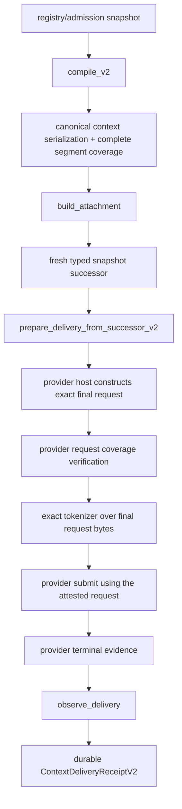

<!-- GENERATED FILE: edit MODULE_MANIFEST.json and run scripts/generate_context_compiler_module_docs.py --write. -->
# Execution dossier: `context.compiler`

## 1. Evidence identity

- Reviewed base: `a126987b84737dbc2ee2592442a314117bddb4a2`
- Working branch: `codex/context-compiler-v2-provider-closure-20260927`
- Manifest SHA-256: `e17a47bffce932b36eac91d7d1a5a1160a6ffe83d8f5809c8e9bd5809a48f930`
- Generator: `scripts/generate_context_compiler_module_docs.py`
- Qualification workflow: `.github/workflows/context-compiler-qualification.yml`
- Receipt artifact: `context-compiler-qualification-receipt`

## 2. Current truth matrix

| Dimension | State | Evidence-based interpretation |
|---|---|---|
| Core implementation | **complete** | V2 compilation, verified admission, canonical byte coverage, typed snapshot successor, attachment, delivery preparation and provider evidence observation are implemented. |
| Product composition | **partial** | Prompt registry, hepta-intelligence, Agentd and the provider-policy extension consume context compiler outputs, but the strict provider-bound V2 preparation is not yet the only serving path. |
| V2 provider closure | **incomplete** | The provider host ABI exposes request digests but no qualified exact tokenizer over the final provider request bytes; strict attestation therefore fails closed until the host capability is supplied. |
| Current-head qualification | **absent** | No immutable qualification receipt for the exact branch head may be claimed before the qualification workflow completes. |

This dossier does not infer release qualification from source presence or a historical workflow.
Only a successful receipt whose `headSha` equals the reviewed commit may change the fourth state.

## 3. Implemented controls

- Verified admission records and complete revocation snapshots.
- Deterministic context selection with mandatory trusted/schema floors.
- Compiler-owned canonical serialization and complete byte coverage.
- Typed snapshot succession for the immediate pre-dispatch recheck.
- Exact provider-request coverage with one canonical context segment and approved typed framing.
- Tokenizer attestation bound to provider, model, binary, version, vocabulary and normalization.
- Existing provider-receipt validation and terminal disposition mapping.
- Deny-all authority on every newly minted proof.

## 4. Product composition finding

The source product path is real rather than hypothetical: prompt registry compilation feeds
`hepta-intelligence`, Agentd stages a runtime attachment, and the provider-policy extension observes
physical dispatch and terminal state. The composition remains **partial** because the current host
ABI exports semantic/request digests but not a qualified exact tokenizer over the final request
bytes. The strict API therefore blocks rather than treating registry token costs as final-request
proof.

## 5. Byte-identity audit

| Object | Owner | Exact material | Digest / witness | Security meaning |
|---|---|---|---|---|
| canonical context bundle | context.compiler | Selected realized context items plus canonical envelope and item headers. | `CanonicalContextCoverageV2.payload_digest` | Every byte is covered; selected item bytes are exact and framing is compiler-owned. |
| prompt fragments | hepta-intelligence / ext.hepta-prompt | Developer-policy fragments projected from the canonical context for host composition. | `PromptRuntimeAttachmentV1.source_binding_digest` | Binds the product projection, but is not itself the complete provider request. |
| provider final request | provider host | Exact bytes submitted after all provider/model framing and request construction. | `VerifiedProviderRequestV2.request_digest` | Exact-tokenizer input; must contain one canonical context segment and only approved typed framing. |
| provider wire semantic digest | core model-provider policy | Secret-free canonical semantics of the physical provider send, excluding credentials and timing. | `ModelProviderInvocationInput.wire_semantic_sha256` | Binds transport semantics; it is not interchangeable with the final-request byte digest. |

The acceptance criterion is byte identity, not merely semantic similarity. The provider send must
consume the request represented by `VerifiedProviderRequestV2`; rebuilding from fragments after
tokenization invalidates the attestation.

## 6. Required execution order

## 7. Test evidence expected from the exact head

The qualification receipt must show successful formatting, focused compilation, strict clippy,
unit/adversarial/generated-corpus tests, cargo-deny, Bazel and repository source/readiness checks.
The workflow records failures instead of deleting or rewriting them and uploads the receipt with
`if: always()` semantics.

## 8. Remaining closure items

1. Supply a qualified host tokenizer implementation for each provider/model profile.
2. Bind the host-generated final request coverage and tokenization attestation into the live provider-policy ABI.
3. Make ContextDeliveryPreparationV2 and ContextDeliveryReceiptV2 the sole Agentd serving and durable terminal path.
4. Produce an immutable successful qualification receipt for the exact branch head.

## 9. Reviewer decision

The core design is complete and materially stronger than the prior trusted-serializer/registered-
count path. Product release remains blocked on host exact-tokenizer composition, sole-path durable
V2 terminal accounting and an all-green receipt for the exact reviewed SHA.
